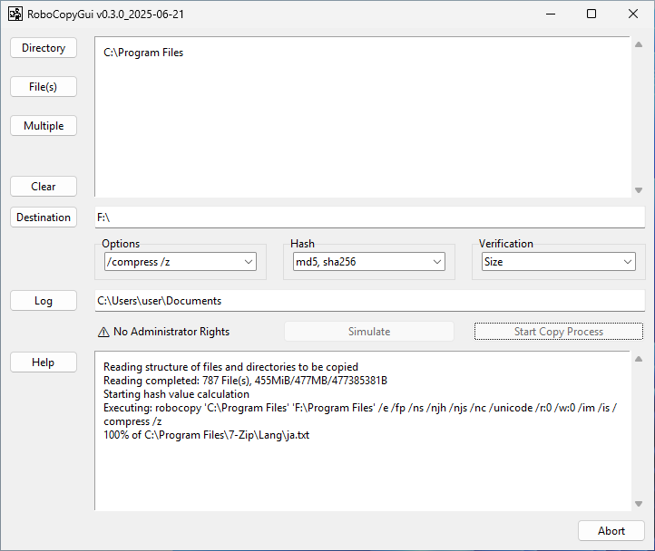

# RoboCopyGui

This is a file copy application with a graphical user interface.

It uses MS Windows' Robocopy for speed and reliability.
An additional verification by file size or hash value is implemented.
A file list with hashes can be created (tab-separated CSV).



## Installation (Developers)

Clone the repo. The make batch script uses Nuitka to build the executable:
```
$ python -m pip install -U nuitka
```
The little batch script now should do the work:
```
$ make-dist.bat
```
Be aware that Nuitka might not work with the newest Python version.

## Download

Download the latest release from GitHub and unpack anywhere. The application is portable. No installation required.

## Language

By default, the English `labels.json` is used. You might delete this file in the app folder and rename `labels_de.json` to `labels.json`. For other languages, just edit `labels.json`.

## Usage

Launch the only executable in the program folder: `robocopygui.exe`

If you have Python installed, you can run `python robocopy.py` directly.

## Legal Notice

### License
Respect GPL-3: https://www.gnu.org/licenses/gpl-3.0.en.html

### Disclaimer
Use the software at your own risk.

This is not a commercial product with an army of developers and a department for quality control behind it.